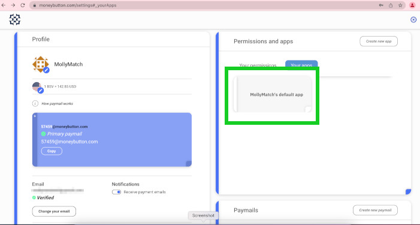

# moneybutton_asset_creation
<u>Create tokens using python!</u>
You will need to set up your Client ID and Client Secret from Moneybutton's app. Screenshot below shows app location in your Moneybutton account. 


````
export CLIENT_SECRET="Your_client_secret_number_here"
export CLIENT_ID="Your_client_ID_number_here"
````
<br />

1. createassets.py Is the file with the code. This is missing the client id and secret. Run this command in your terminal. This creates a local hidden file with the password.
<br />
```
export CLIENT_SECRET="Your_client_secret_number_here"
export CLIENT_ID="Your_client_ID_number_here"
```
<br />
1. For lines 6 & 7 I added os.environ
```
client_id = os.environ.get('CLIENT_ID')# insert Moneybutton
client id by export CLIENT_ID local file
client_secret = os.environ.get('CLIENT_SECRET')# insert MB client secret by using export CLIENT_SECRET local file
```
